# Model Quantization Technical Report 
---

## Table of Contents
1. [Introduction](#1-introduction)  
2. [Quantization Methods](#2-quantization-methods)  
3. [Code Implementation](#3-code-implementation)  
4. [Dependency Matrix](#4-dependency-matrix)  
5. [Performance Comparison](#5-performance-comparison)  
6. [Hardware Support](#6-hardware-support)  
7. [Implementation Checklist](#7-implementation-checklist)  
8. [Troubleshooting Guide](#8-troubleshooting-guide)  
9. [Workflow Diagram](#9-workflow-diagram)  
10. [Tools & Libraries](#10-tools--libraries)  
11. [Conclusion](#11-conclusion)  
12. [Appendices](#12-appendices)  

---

## 1. Introduction <a name="1-introduction"></a>
Quantization reduces neural network precision for efficient deployment:  
- **4× memory reduction** (FP32 → INT8)  
- **2-3× faster inference**  
- **60% energy savings**  
- **Supported formats:** INT8, INT4, FP16, BF16


## Types of Quantization Methods

| Method       | Full Form                          | Key Information                                                                 | When to Use                                                                 |
|--------------|------------------------------------|---------------------------------------------------------------------------------|-----------------------------------------------------------------------------|
| **PTQ**      | Post-Training Quantization         | - No retraining needed<br>- Fast deployment<br>- Moderate accuracy drop         | Edge devices, Batch processing, Quick prototyping                          |
| **QAT**      | Quantization-Aware Training        | - Simulates quantization during training<br>- Minimal accuracy loss             | High-accuracy requirements, Medical imaging, Safety-critical systems       |
| **GPTQ**     | Gradient-based Post-Training Quant | - 4-bit LLM quantization<br>- GPU-optimized<br>- Requires calibration data      | Large language models (LLaMA, Mistral), Chat applications                   |
| **AWQ**      | Activation-aware Weight Quantization | - 4-bit with activation awareness<br>- Better outlier preservation              | Instruction-tuned models, Complex prompt engineering                        |
| **Dynamic**  | Dynamic Quantization               | - On-the-fly activation quantization<br>- Flexible but higher latency           | NLP models, Variable input lengths                                          |
| **Static**   | Static Quantization                | - Pre-calibrated ranges<br>- Faster inference<br>- Needs representative data    | Computer vision, Fixed input sizes  
                                        

### FLOWCHART 

```mermaid
graph TD
  A[Start Quantization] --> B{Retraining Possible?}
  B -->|Yes| C[QAT Pathway]
  B -->|No| D[PTQ Pathway]
  
  %% QAT Branch
  C --> C1[Implement Fake Quantization Layers]
  C1 --> C2[Fine-tune Model]
  C2 --> C3{Accuracy Valid?}
  C3 -->|Yes| C4[Export Quantized Model 🚀]
  C3 -->|No| C5[Adjust Training Parameters]
  C5 --> C2
  
  %% PTQ Branch
  D --> D1{Model Type?}
  D1 -->|LLM| D2[GPTQ/AWQ 4-bit]
  D1 -->|Vision| D3[Static PTQ]
  D1 -->|NLP| D4[Dynamic PTQ]
  
  %% LLM Subpath
  D2 --> D21[Prepare Calibration Data]
  D21 --> D22[Run GPTQ Optimization]
  D22 --> D23[Validate Perplexity]
  
  %% Vision/NLP Subpaths
  D3 --> D31[Collect Representative Dataset]
  D31 --> D32[Calibrate Activations]
  D32 --> D33[Convert to INT8]
  
  D4 --> D41[Quantize Weights]
  D41 --> D42[Runtime Activation Quantization]
  
  %% Validation Node
  D23 --> E[Performance Validation]
  D33 --> E
  D42 --> E
  
  E --> F{Meets Targets?}
  F -->|Yes| G[Deploy Model 🚀]
  F -->|No| H[Debug Pipeline]
  H -->|Calibration Issues| D21
  H -->|Architecture Issues| B
  
  style A fill:#4CAF50,stroke:#388E3C
  style B fill:#FFC107,stroke:#FFA000
  style C fill:#2196F3,stroke:#1976D2
  style D fill:#2196F3,stroke:#1976D2
  style G fill:#4CAF50,stroke:#388E3C
  style H fill:#F44336,stroke:#D32F2F
```

---

## 2. Quantization Methods <a name="2-quantization-methods"></a>

### 2.1 Post-Training Quantization (PTQ)
```python
# TensorFlow Lite Example
import tensorflow as tf

converter = tf.lite.TFLiteConverter.from_saved_model("model/")
converter.optimizations = [tf.lite.Optimize.DEFAULT]
tflite_quant_model = converter.convert()
```
### 2.2 Quantization-Aware Training (QAT)
```python
# PyTorch Example
import torch.ao.quantization

model.qconfig = torch.ao.quantization.get_default_qat_qconfig('fbgemm')
torch.ao.quantization.prepare_qat(model, inplace=True)
# Training loop here
torch.ao.quantization.convert(model, inplace=True)
```

### 2.3 GPTQ (4-bit)
```python
from auto_gptq import AutoGPTQForCausalLM

model = AutoGPTQForCausalLM.from_quantized(
    "TheBloke/Llama-3-8B-GPTQ",
    use_safetensors=True,
    device_map="auto"
)
```

### 2.4 AWQ (4-bit)
```python
from awq import AutoAWQForCausalLM

quantizer = AutoAWQForCausalLM.quantize(
    model,
    quant_config={"zero_point": True, "q_group_size": 128}
)
```

## 3. Code Implementation <a name="3-code-implementation"></a>
### 3.1 4-bit Loading with bitsandbytes
```python
from transformers import BitsAndBytesConfig

bnb_config = BitsAndBytesConfig(
    load_in_4bit=True,
    bnb_4bit_quant_type="nf4",
    bnb_4bit_compute_dtype=torch.bfloat16
)

model = AutoModelForCausalLM.from_pretrained(
    "meta-llama/Llama-3-8B",
    quantization_config=bnb_config
)
```

### 3.2 Dynamic Quantization
```python
# Dynamic quantization for LSTM
quantized_model = torch.quantization.quantize_dynamic(
    model,
    {torch.nn.LSTM},
    dtype=torch.qint8
)
```

## 4. Dependency Matrix <a name="4-dependency-matrix"></a>
| Tool/Library         | PyTorch | TensorFlow | ONNX | Requirements               |
|----------------------|---------|------------|------|----------------------------|
| **Optimum**          | ✅       | ❌          | ✅    | `transformers>=4.25`       |
| **TFLite**           | ❌       | ✅          | ❌    | `tensorflow>=2.10`         |
| **Intel Neural Compressor** | ✅ | ✅ | ✅ | `neural-compressor>=2.0` |

---

## 5. Performance Comparison <a name="5-performance-comparison"></a>
| Metric               | FP32    | INT8     | INT4     |
|----------------------|---------|----------|----------|
| **Model Size (MB)**  | 420     | 105      | 55       |
| **Latency (ms)**     | 45      | 22       | 30       |
| **Accuracy**         | 84.5%   | 83.1%    | 82.3%    |
| **RAM Usage (MB)**   | 1200    | 600      | 450      |
| **Energy (Joules)**  | 12.5    | 5.8      | 7.2      |

---

## 6. Hardware Support <a name="6-hardware-support"></a>
| Hardware             | PTQ     | QAT     | 4-bit   | Notes                      |
|----------------------|---------|---------|---------|----------------------------|
| **Intel CPUs**       | ✅       | ✅       | ❌       | AVX-512 required for INT8  |
| **NVIDIA GPUs**      | ✅       | ✅       | ✅       | Ampere+ for 4-bit          |
| **ARM Cortex-M**     | ✅       | ❌       | ❌       | Limited to INT8            |
| **Apple M1/M2**      | ✅       | ❌       | ❌       | CoreML compatibility       |
---
## 7. Implementation Checklist <a name="7-implementation-checklist"></a>


**Visual Legend**:  
- 🟦 Blue Boxes: Main Checklist Items  
- 🟩 Green Boxes: Actionable Tasks  
- ⬛ Black Diamonds: Data Requirements  
- Arrows: Workflow Sequence
---
## 8. Troubleshooting Guide <a name="8-troubleshooting-guide"></a>  
| Issue                | Root Cause          | Solution                   |  
|----------------------|---------------------|----------------------------|  
| **Severe Accuracy Drop** | Poor calibration data | Use larger/diverse dataset |  
| **Runtime Errors**    | Unsupported ops     | Check framework compatibility (e.g., `torch.quantized_lstm`) |  
| **Model Bloat**       | Mixed precision     | Force INT8-only conversion |  
| **Calibration Crash** | Input range mismatch | Normalize inputs to [0, 1] |  

---

## 9. Workflow Diagram <a name="9-workflow-diagram"></a>  


## 10. Tools & Libraries <a name="10-tools--libraries"></a>  
### Core Tools  
| Tool                 | Framework      | Use Case                   | Command/API Example                   |  
|----------------------|----------------|----------------------------|---------------------------------------|  
| **Optimum Intel**    | PyTorch        | CPU-Optimized Quantization | `OVQuantizer.from_pretrained(model)`  |  
| **TFLite Converter** | TensorFlow     | Mobile Deployment          | `tf.lite.Optimize.DEFAULT`            |  
| **bitsandbytes**     | PyTorch        | 4-bit LLMs                 | `BitsAndBytesConfig(load_in_4bit=True)` |  
| **AutoGPTQ**         | Transformers   | GPTQ 4-bit                 | `AutoGPTQForCausalLM.from_quantized()`|  

### Specialized Libraries  
- **ONNX Runtime**: `onnxruntime.quantization.quantize_static()`  
- **NVIDIA TensorRT**: `trt.Builder.create_network()` (FP16/INT8)  
- **Apple CoreML**: `coremltools.convert()` (iOS/macOS)  

---

## 11. Conclusion <a name="11-conclusion"></a>  
### Key Recommendations  
| Scenario              | Solution                          | Toolchain               |  
|-----------------------|-----------------------------------|-------------------------|  
| **Low Latency**       | INT8 Static PTQ                   | PyTorch/Optimum + ONNX  |  
| **LLM Deployment**    | 4-bit GPTQ/AWQ                    | Hugging Face + bitsandbytes |  
| **Accuracy Critical** | QAT with Layer-wise Calibration   | TensorFlow/PyTorch QAT  |  

### Limitations  
- **4-bit Quantization**: Requires Ampere GPUs (NVIDIA A100/RTX 30xx+).  
- **Dynamic Quantization**: Not supported for all ops (e.g., `LayerNorm`).  

---

## 12. Appendices <a name="12-appendices"></a>  
### A. Version Compatibility  
| Library              | Quantization Support            | Version Requirement |  
|----------------------|----------------------------------|---------------------|  
| PyTorch              | PTQ/QAT                         | >=2.0               |  
| TensorFlow           | TFLite PTQ                      | >=2.10              |  
| Transformers         | 4-bit/AWQ/GPTQ                  | >=4.31              |  

